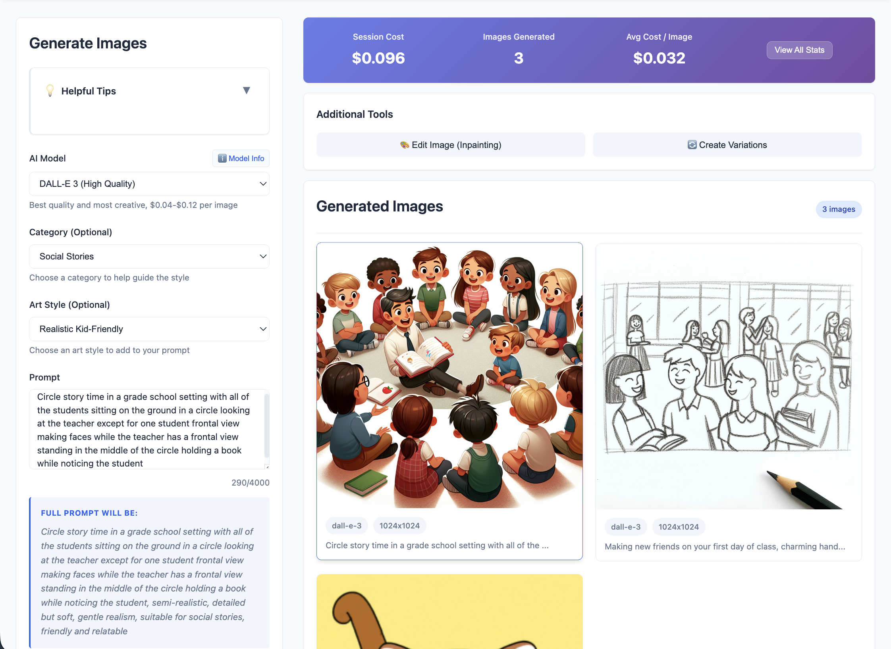

# Todd Image Dashboard

> AI-Powered Educational Image Generation for Special Needs Education

A web application that helps educators create high-quality visual materials for students with special needs using OpenAI's image generation models (GPT Image 1, DALL-E 3, and DALL-E 2).



## Overview

Todd Image Dashboard is designed specifically for teachers working with children with special needs. Generate educational visual aids, social stories, emotion cards, visual schedules, and more using AI technology—saving time and reducing costs.

### Key Features

- **🎯 Easy Installation** - Automated PowerShell script for Windows (one-click setup, no command line required)
- **🚀 Welcome Wizard** - 6-step interactive onboarding for first-time users
- **📦 32 Educational Presets** - Pre-configured templates across 15 specialized categories
- **💡 26 Interactive Tips** - Auto-rotating guidance panel with practical examples
- **🤖 3 AI Models** - GPT Image 1, DALL-E 3, and DALL-E 2 with detailed comparison guides
- **📊 Cost Tracking** - Real-time monitoring of API usage and spending
- **🎨 Advanced Controls** - Background transparency, styles, quality settings, batch generation
- **🖼️ Image Management** - Gallery view with download, metadata, and local storage
- **⚙️ Settings** - Secure API key management and usage statistics
- **🔄 Editing Tools** - Inpainting and variations support

## Technology Stack

- **Frontend:** Vue 3, Vite, Axios
- **Backend:** Node.js, Express.js, Multer
- **APIs:** OpenAI (GPT Image 1, DALL-E 3, DALL-E 2)
- **Storage:** LocalStorage for settings, file system for images

---

## Installation

### Prerequisites

- **Node.js** (v16 or higher) - [Download here](https://nodejs.org/)
- **OpenAI API Key** - [Get one here](https://platform.openai.com/api-keys)

### Windows - Automated Installation (Recommended)

We've created an automated PowerShell script that handles everything:

1. **Download/extract** the project to your desired location
2. **Navigate to the project folder** in File Explorer
3. **Right-click** on `install.ps1` and select **"Run with PowerShell"**
4. **Confirm** when prompted that you're in the correct folder
5. **Wait** while the script:
   - Checks for Node.js (installs if missing using winget)
   - Creates required directories (`Images`, `data`, `uploads`)
   - Installs all dependencies for server and client
   - Creates a `start.ps1` launcher script
6. **Done!** Double-click `start.ps1` to launch the dashboard anytime

**Optional:** Create a desktop shortcut to `start.ps1` for quick access.

**No command line experience needed!** The script handles everything automatically.

### Mac/Linux - Manual Installation

#### 1. Install Dependencies

```bash
# Install root dependencies
npm install

# Install server dependencies
cd server && npm install && cd ..

# Install client dependencies
cd client && npm install && cd ..
```

#### 2. Create Required Directories

```bash
mkdir Images uploads
```

#### 3. Start the Application

```bash
npm start
```

This starts both the server (port 3000) and client (port 5173) concurrently.

#### 4. Open in Browser

Navigate to `http://localhost:5173`

The Welcome Wizard will guide you through initial setup!

### First-Time Setup

1. **Launch the Application** - Welcome Wizard auto-launches for new users
2. **Configure API Key** - Click Settings (⚙️) and enter your OpenAI API key
3. **Explore Presets** - Browse 32 educational templates
4. **Generate First Image** - Try a preset or write a custom prompt

### Troubleshooting

**"No API key configured"**
- Go to Settings (⚙️) and enter your OpenAI API key (must start with 'sk-')

**Images not generating**
- Verify API key is valid at [OpenAI Dashboard](https://platform.openai.com/account/api-keys)
- Check you have OpenAI credits available
- Ensure server is running on port 3000

**Port conflicts**
- Change PORT in `.env` file or stop other applications using ports 3000/5173

**For detailed documentation:**
- Open [INSTALL.html](INSTALL.html) in your browser for a visual guide
- Read [INSTALL.md](INSTALL.md) for comprehensive instructions

---

## Quick Usage Guide

### Generating Images

1. **Select a Model** - Click "ℹ️ Model Info" for detailed comparison
2. **Write a Prompt** - Be specific, or load a preset and customize it
3. **Configure Settings** - Set size, quality, and preview estimated cost
4. **Generate** - Click "Generate Image(s)" and wait 10-30 seconds
5. **Download** - Save from the gallery

### Using Presets

- **Load:** Click "📦 Load Preset" → Search/Filter → Select
- **Customize:** Replace [PLACEHOLDERS] with your specific content
- **Save:** Configure settings → "💾 Save as Preset"

### Example Presets

- **Visual Schedule** - Morning routines, transitions, activity icons
- **Emotion Cards** - Happy, sad, angry faces for identification
- **Social Stories** - Character scenes for social situations
- **Science Diagrams** - Labeled educational illustrations
- **Math Visuals** - Counting cards, number recognition

## Pricing

| Model | Standard | HD | Best For |
|-------|----------|-----|----------|
| **GPT Image 1** | $0.04 | $0.12 | Diagrams with text/labels |
| **DALL-E 3** | $0.04 | $0.08 | Creative illustrations |
| **DALL-E 2** | $0.016-$0.02 | N/A | Budget projects (4-5x cheaper) |

💡 **Tip:** Use DALL-E 2 for testing prompts, then regenerate favorites with higher quality models.

*Prices subject to change. Check [OpenAI Pricing](https://openai.com/pricing) for current rates.*

---

## Project Structure

```
todd-image-dashboard/
├── server/              # Backend (Express, API routes)
├── client/              # Frontend (Vue 3)
├── Images/              # Generated images storage
├── data/                # Presets configuration
├── uploads/             # Temporary uploads
├── install.ps1         # Windows automated installer
├── INSTALL.md          # Detailed installation guide
├── INSTALL.html        # Visual installation guide
└── README.md           # This file
```

## Security & Privacy

- **API Keys** - Stored locally in browser only, never on servers
- **Images** - Saved locally on your machine
- **No Tracking** - No analytics or data collection
- **Local First** - Everything runs on your computer

## License

This project is provided as-is for educational purposes. OpenAI API usage is subject to OpenAI's terms of service and pricing.

---

**Built with ❤️ for educators supporting students with special needs**

*For detailed features, usage examples, and advanced tips, launch the application and explore the Welcome Wizard and Tips Panel.*
